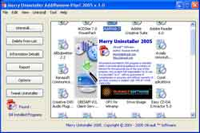



## Merry Uninstaller 2005

### Description

Merry Uninstaller Add/Remove Plus! 2005

this Version is complete program uninstaller or add/remove for windows.

But if you look this code i think you can understand. On this program you can:

- Easy to uninstaller or add/remove program

- Edit Entry on uninstall registry

- New Entry on uninstall registry

- Delete Entry on uninstall registry

- Create Backup Registry (Export and import Registry)

- Create Report about information program registry

- Look Detail Information program on registry

- Look Location Program Groups

- Tweaks Add or Remove Programs

See And Download... dont forget vote me...
 
### More Info
 

             |
---                |---
**Submitted On**   |2003-08-08 13:12:56
**By**             |[Rusman Indradi](https://github.com/Planet-Source-Code/PSCIndex/blob/master/ByAuthor/rusman-indradi.md)
**Level**          |Beginner
**User Rating**    |5.0 (25 globes from 5 users)
**Compatibility**  |VB 5\.0, VB 6\.0
**Category**       |[Complete Applications](https://github.com/Planet-Source-Code/PSCIndex/blob/master/ByCategory/complete-applications__1-27.md)
**World**          |[Visual Basic](https://github.com/Planet-Source-Code/PSCIndex/blob/master/ByWorld/visual-basic.md)
**Archive File**   |[Merry\_Unin1928528292005\.zip](https://github.com/Planet-Source-Code/rusman-indradi-merry-uninstaller-2005__1-62378/archive/master.zip)

